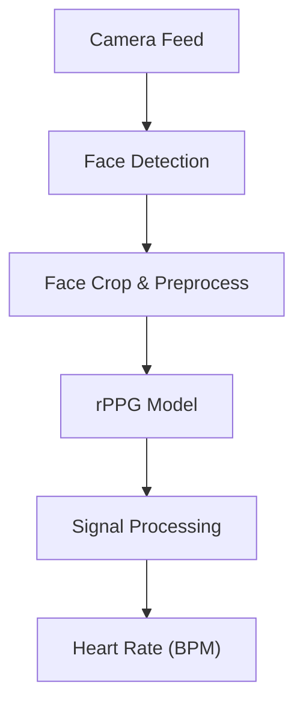
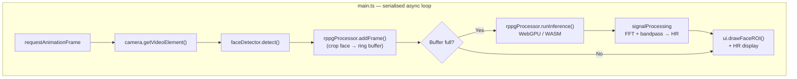

# NeuroWASM

**Real-time heart rate monitoring in the browser — no server, no cloud, no latency.**

NeuroWASM runs rPPG (remote photoplethysmography) and face detection models entirely on-device using [ONNX Runtime Web](https://onnxruntime.ai/docs/get-started/with-javascript/web.html). It captures live webcam video, detects your face, extracts the blood volume pulse signal from skin colour changes, and estimates heart rate — all inside a single browser tab.

Two inference backends are supported:

| Backend | When to use |
|---|---|
| **WebGPU** | Modern Chromium — runs the models on your GPU via the WebGPU API |
| **CPU / WASM** | Any browser — runs the models in a WASM thread pool using SIMD + threads |

---

## Demo



Estimates real-time heart rate from facial video using rPPG models (EfficientPhys, FactorizePhys) with face detection (BlazeFace, UltraFace).

---

## Getting Started

### Prerequisites

- [Node.js](https://nodejs.org/) 18+
- A Chromium-based browser (Chrome / Edge) for WebGPU support
- A YOLO ONNX model file (e.g. `yolo26n.onnx`) placed in the `public/` directory

### Install & run

```bash
git clone https://github.com/your-username/NeuroWASM.git
cd NeuroWASM
npm install
npm run dev
```

Open `http://localhost:5173` in Chrome. Grant camera permission when prompted.

### Build for production

```bash
npm run build      # outputs to dist/
npm run preview    # serve the built bundle locally
```

---

## Architecture

```
NeuroWASM/
├── index.html                # Single-page shell: video, canvas, controls
├── public/
│   ├── blazeface_128.onnx    # BlazeFace face detector (default)
│   ├── ultraface_320.onnx    # UltraFace face detector (legacy)
│   ├── efficientphys.onnx    # EfficientPhys rPPG model
│   └── factorizephys.onnx    # FactorizePhys rPPG model
├── model_conversion/         # Python scripts to convert models to ONNX
└── src/
    ├── main.ts               # App entry point & frame loop
    ├── sessionManager.ts     # Measurement session lifecycle
    ├── camera.ts             # MediaDevices camera abstraction
    ├── faceDetector.ts       # UltraFace face detector
    ├── mediapipeDetector.ts  # BlazeFace face detector
    ├── rppgProcessor.ts      # EfficientPhys rPPG inference
    ├── factorizePhysProcessor.ts # FactorizePhys rPPG inference
    ├── signalProcessing.ts   # BVP → heart rate (FFT, bandpass)
    ├── qualityMonitor.ts     # Signal quality assessment
    ├── ui.ts                 # Canvas renderer + HTML control wiring
    └── style.css             # Global styles
```

### Data flow per frame



### Key design decisions

**Serialised frame loop** — inference is `await`-ed before the next `requestAnimationFrame` is requested. This prevents WebGPU buffer race conditions (`Buffer was unmapped before mapping was resolved`) that occur when the GPU is still finishing a previous `OrtRun` when the next frame fires.

**Sliding window rPPG** — face crops are stored in a pre-allocated ring buffer. Once enough frames accumulate (151 for EfficientPhys, 160 for FactorizePhys), inference runs on the full window. Subsequent inferences slide forward by 30 frames, reusing most of the buffer.

**Hot-swap models & backends** — changing any dropdown (face detector, rPPG model, backend) disposes the current ONNX sessions and creates new ones without a page reload. The frame loop exits cleanly via an `isRunning` flag.

**WebGPU fallback** — if WebGPU is unavailable, the app automatically falls back to the WASM backend and shows an in-app guide with instructions to enable GPU acceleration.

---

## GPU Performance

### Why WebGPU and not WebGL?

ONNX Runtime Web's WebGPU backend uses compute shaders, which map directly to the GPU's tensor math units. WebGL can only express GPU computation through rasterization APIs (vertex/fragment shaders), which is significantly slower for matrix operations.

### Forcing Chrome to use your NVIDIA GPU

On Windows laptops with hybrid graphics (Intel integrated + NVIDIA discrete), Chrome often defaults to the Intel GPU for WebGPU — even when the "High Performance" option is selected in the backend dropdown. This is a [known Chromium limitation](https://bugs.chromium.org/p/chromium/issues/detail?id=1307634): the `powerPreference` hint in `requestAdapter()` is currently ignored on Windows.

**To force Chrome to use your NVIDIA GPU:**

#### Option A — Windows Graphics Settings (recommended)

1. Open **Settings → System → Display**
2. Scroll down and click **Graphics settings**
3. Under "Add an app", choose **Desktop app** from the dropdown and click **Browse**
4. Navigate to your Chrome executable:
   - Usually `C:\Program Files\Google\Chrome\Application\chrome.exe`
5. Once Chrome appears in the list, click **Options**
6. Select **High performance** and click **Save**
7. **Restart Chrome completely** (close all windows, wait a few seconds, reopen)

#### Option B — NVIDIA Control Panel

1. Right-click the desktop → **NVIDIA Control Panel**
2. Go to **3D Settings → Manage 3D Settings → Program Settings**
3. In the dropdown, select **Google Chrome** (add it manually if not listed)
4. Set **"Preferred graphics processor"** to **High-performance NVIDIA processor**
5. Click **Apply** and restart Chrome

After either change, open Chrome DevTools console and look for:

```
🎮 WebGPU Adapter: nvidia — NVIDIA GeForce RTX ... (high-performance)
```

This confirms Chrome is now routing WebGPU to your NVIDIA card.

---

## Controls

| Control | Description |
|---|---|
| Camera dropdown | Switch between available webcam inputs |
| Backend dropdown | Switch inference backend (WebGPU / WASM) |
| rPPG Model dropdown | EfficientPhys (default) or FactorizePhys |
| Face Detector dropdown | BlazeFace (default) or UltraFace-320 |
| Measure button | Start / stop heart rate measurement |
| Status badge | Current state: Initializing / Ready / Measuring / Error |
| FPS badge | Face detection throughput (frames per second) |

---

## Models

### rPPG (heart rate estimation)

| Model | Input | Output | Size |
|---|---|---|---|
| **EfficientPhys** | `[1, 151, 3, 72, 72]` — 151 face crops | `[1, 150]` BVP signal | ~8.7 MB |
| **FactorizePhys** | `[1, 160, 3, 72, 72]` — 160 face crops | `[1, 159]` BVP signal | ~280 KB |

### Face detection

| Model | Input | Output | Size |
|---|---|---|---|
| **BlazeFace** | `[1, 3, 128, 128]` NCHW | 896 anchor boxes + scores | ~0.4 MB |
| **UltraFace-320** | `[1, 3, 240, 320]` NCHW | confidence + boxes | ~1.2 MB |

### Model conversion

See [model_conversion/README.md](model_conversion/README.md) for Docker-based conversion from PyTorch/TFLite to ONNX.

---

## Tech Stack

| | |
|---|---|
| **Runtime** | [ONNX Runtime Web](https://onnxruntime.ai/) 1.24 |
| **Build tool** | [Vite](https://vitejs.dev/) 7 |
| **Language** | TypeScript 5.9 |
| **UI** | Vanilla Canvas API + custom CSS |
| **GPU API** | WebGPU (via ORT WebGPU backend) |
| **CPU fallback** | WASM with SIMD + multi-threading |

---

## Browser Support

| Browser | WebGPU | WASM fallback |
|---|---|---|
| Chrome 113+ | ✅ | ✅ |
| Edge 113+ | ✅ | ✅ |
| Firefox | ⚠️ experimental flag | ✅ |
| Safari 18+ | ✅ (macOS/iOS) | ✅ |

WebGPU must be enabled. In older Chrome builds you can force-enable it at `chrome://flags/#enable-unsafe-webgpu`.

---

## License

MIT
